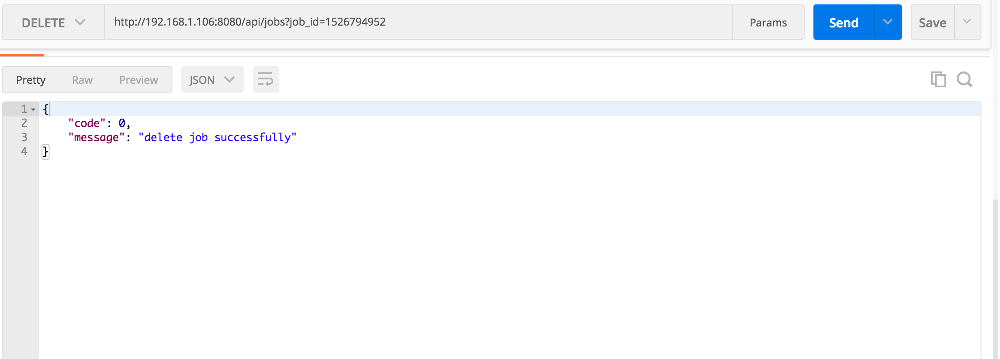
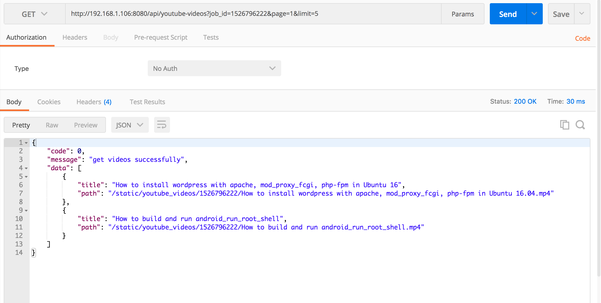

# 后端接口说明

## 任务队列

### 新增

### 查询

YouTube和其他站点区别开

如果查询youtube，加一个参数website

### 删除

## 数据库

### 查询

#### 查询搜索微博

/tweet-search

#### 查询用户微博

/tweet-person

#### 查询用户信息

/person

#### 查询用户关系

/relationship

#### 查询评论

/comment

## 日志

### 获取

## 视频

### 获取指定任务视频列表

